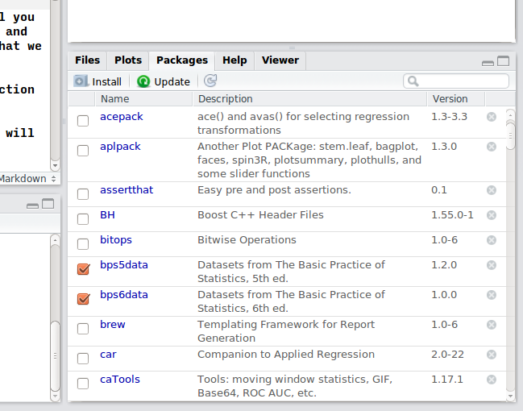
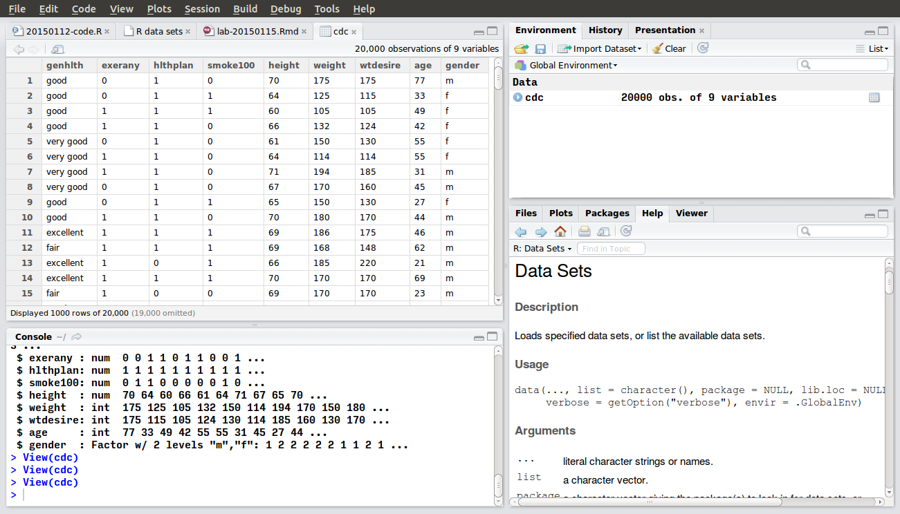

# Downloading and Installing R


# Using RStudio

This lab introduces you to R and RStudio, which you will be using throughout this course to apply and learn the statistical concepts discussed in class.
But before we begin, let's clarify some terminology.
R is the name of the programming language, and RStudio is a convenient and widely used interface to that language.

The purpose of this lab is to build some basic fluency in R, and R commands to implement cover some of the concepts in Chapters 2 and 3 of *The Basic Practice of Statistics*.

# RStudio

R is the name of the programming language, and RStudio is a convenient and widely used interface to that language.
R is a programming language, and RStudio is a n
You should familiarize yourself with the RStudio GUI.


It consists of four windows,

1. Bottom left: The **console** window. You type commands at the ``>`` prompt and R executes them.
2. Top left: The **editor** window. Here you can edit and save R scripts which contain multiple R commands.
    - You can open a new R script using *File -> New -> R script*.
    - If you highlight an area, you can run those commands in the console with the "Run" button.
    - You can run all the commands in the **editor** window using the "Source" button.
3. Top right
    - **workspace** lists all R objects (variables) that are defined
    - **history** lists all the commands that have been typed into the console.
4. Bottom right

    - **files** allows you to browse directories and open files.
    - **plots** displays any plots created. In this window you can toggle back through previously created plots.
    - **packages** shows which packages are installed and loaded.
    - **help** displays R help.

RStudio documentation can be found at <http://www.rstudio.com/ide/docs/>.
Of those, the most likely to be useful to you are:

- [Working in the Console](http://www.rstudio.com/ide/docs/using/console)
- [Editing and Executing Code](http://www.rstudio.com/ide/docs/using/source)
- [Viewing Command History](http://www.rstudio.com/ide/docs/using/history)


# Installing and Loading Packages

One of the best features of R is that, at the time of writing, there are over 6,000 packages which add functions and data to R.
The current list of packages is can be found on [CRAN](http://cran.r-project.org/web/packages/), the R project's homepage.

You will use several packages in this course, so you will need to know how to install them.
Using a package requires two steps.

1. installing
2. loading

These two steps are analogous to downloading/installing a program and opening/executing a program, respectively.
Installing the package downloads the code onto your computer so that R can make use of it.
Loading a package makes the functionality contained in the package available to your current R session.
You only need to to install the package once, although if new versions of the package become available, you may need to update or reinstall the package.

This course will make use of several packages. 
The following code will download and install these packages.

If you are working on a CSSCR lab computer these should have already been installed.
```{r,eval=FALSE}
install.packages(c("devtools", "ggplot2"))
devtools::install_github("jrnold/bps5data")
```
The previous code installs these packages:

- **bps5data** add datasets included in *BPS* 5th edition.
- **ggplot2** is a popular and widely used graphics package that you will use to create plots.
- **devtools** is just needed to install the other packages.

Before you use any of the code in these packages, you need to load them using the function `library`:
```{r}
library("ggplot2")
library("bps5data")
```

You can see which packages are installed and loaded using the **Packages** tab in the lower right panel. 
All packages that are installed are listed. 
Packages that are loaded are checked.
By checking (un-checking) the box next to a package you can load (unload) that package.

<!--  -->
\begin{figure}
\centering
\includegraphics[height=2in]{images/Packages.png}
\caption{Packages panel in RStudio showing installed and loaded packages. All the packages that appear are installed. \textbf{bps5data} and \textbf{bps6data} are loaded. }
\end{figure}
\clearpage


# Using R as a calculator

Although it is so much more, you can use R as a calculator. For example, to add, subtract, multiply or divide:
```{r }
2 + 3
2 - 3
2 * 3
2 / 3
```

The power of a number is calculated with ``^``, e.g. $4^2$ is,

```{r }
4 ^ 2
```

R includes many functions for standard math functions.
For example, the square root function is ``sqrt``, e.g. $\sqrt{2}$,

```{r }
sqrt(2)
```

And you can combine many of them together
```{r}
(2 * 4 + 3 ) / 10
sqrt(2 * 2)
```

# Variables and Assignment

In R, you can save the results of calculations into objects that you can use later.
This is done using the special symbol, ``<-``.
For example, this saves the results of 2 + 2 to an object named ``foo``.
```{r}
foo <- 2 + 2
```
You can see that ``foo`` is equal to ``4``
```{r}
foo
```
And you can reuse foo in other calculations,
```{r}
foo + 3
foo / 2 * 8 + foo
```

# Using R as a calculator

Although it is so much more, you can use R as a calculator. For example, to add, subtract, multiply or divide:
```{r }
2 + 3
2 - 3
2 * 3
2 / 3
```

The power of a number is calculated with ``^``, e.g. $4^2$ is,

```{r }
4 ^ 2
```

R includes many functions for standard math functions.
For example, the square root function is ``sqrt``, e.g. $\sqrt{2}$,

```{r }
sqrt(2)
```

And you can combine many of them together
```{r}
(2 * 4 + 3 ) / 10
sqrt(2 * 2)
```

# Variables and Assignment

In R, you can save the results of calculations into objects that you can use later.
This is done using the special symbol, ``<-``.
For example, this saves the results of 2 + 2 to an object named ``foo``.
```{r}
foo <- 2 + 2
```
You can see that ``foo`` is equal to ``4``
```{r}
foo
```
And you can reuse foo in other calculations,
```{r}
foo + 3
foo / 2 * 8 + foo
```


# Data and Data Frames

*Data frames* in R correspond to what you usually think of as a dataset or a spreadsheet, rows are observations and columns are variables.

R can import data in a variety of sources, such as csv files.
And, in most real applications, you will be loading data from an external source.
However, to keep things simple for this lab we will use datasets from some of the packages installed at the start of this lab.

Today we will use the a dataset derived from the Behavioral Risk Factor Surveillance System (BRFSS), an annual telephone survey of 350,000 people in the United States conducted by the Center for Disease Control (CDC).
As its name implies, the BRFSS is designed to identify risk factors in the adult population and report emerging health trends.
For example, respondents are asked about their diet and weekly physical activity, their HIV/AIDS status, possible tobacco use, and even their level of healthcare coverage.
The BRFSS Web site (http://www.cdc.gov/brfss) contains a complete description of the survey, including the research questions that motivate the study and many interesting results derived from the data.

We will focus on a random sample of 20,000 people from the BRFSS survey conducted in 2000. While there are over 200 variables in this data set, we will work with a small subset.
We will download this data and load it as a data frame named `cdc`:
```{r}
source("http://www.openintro.org/stat/data/cdc.R")
```
You should see an object ``cdc`` in the **Environment** panel (upper right).

You can view the data and get basic information like the number of rows, number of columns, and names of the variables in a couple ways.
 
Use the ``View`` function to open a spreadsheet view of the data in the upper left panel,
```{r,eval = FALSE}
View(cdc)
```



Use the ``dim`` function to get the number of columns (variables) and rows (individuals) 
```{r}
dim(cdc)
```
The first number is the number of rows, and the second number is the number of columns.

Use the ``names`` function to get the names of the variables:
```{r}
names(cdc)
```

To extract a single column from the data frame use ``$``.
For example, to extract the *height* column of the *cdc*, use ```cdc$height``.
```
```{r, eval = FALSE}
cdc$height
```
This will print a long list of numbers.

# Descriptive Statistics

R has many functions. In this section you will learn a few which cover the descriptive statistics introduced in Chapter 2 of *BPS*.

To get a general summary of the dataset, use the ``summary`` function
```{r}
summary(cdc)
```
Notice that ``summary`` returns the 5-number summary and the mean.

To calculate the mean of a column (``weight``),
```{r}
mean(cdc$weight)
```
the median,
```{r}
median(cdc$weight)
```
standard deviation,
```{r}
sd(cdc$weight)
```
variance,
```{r}
var(cdc$weight)
```
1st and 3rd quartiles
```{r}
quantile(cdc$weight, c(0.25, 0.75))
```
and inter-quartile range
```{r}
IQR(cdc$weight)
```

# R Scripts

You can save R commands in a file called an R script. 
To create a new R Script use *File -> New File -> R Script*.
This will create a new tab in the upper left panel which will have a name like "Untitled1".
Save this to a file with the extension ".R" (RStudio will warn you if you do not)

To see how this works, write a few commands in the editor.
For example,
```{r}
2 + 2
3 + 8
mean(c(1, 2, 3))
```
You can run the current line or highlighted section with *Ctl-Enter* or the *Run* button. 
You can run the *entire* script with *Ctl-Shift-S* or the *Source* button.


# Comments

Any R code following a hash (``#``) is not executed.
These are called comments, and can be used to annotate and explain your code.
For example, this doesn't do anything.
```{r }
# hello, world!
```
And in this, nothing after the ``#`` is executed,
```{r }
2 + 2 # hello, world!
```
Although you can put comments on the same line after code, it is good practice to put comments on separate lines


# R scripts and R

- What is an R script?
- What is the difference between an R script and the file? 
- What is the difference between the workspace and the code? Note that the code should be considered real, and the results computed in the workspace temporary.
- Tips on getting help and TAB-completion, up and down history

# Installing packages

- Install ggplot2 using `install_packages`
- Is there a way to install a package from `github` ? Probably `hadley/haven` to read Stata files.

# Creating your first R Markdown Document

- Create a markdown document
- This should have a pretty graph
- Save it to html and doc. Saving to pdf would require instal

# Introduction to ggplot2

- Either the vignette for ggplot2 or Kathrik Ram's tutorial (http://inundata.org/2013/04/10/a-quick-introduction-to-ggplot2/; referenced in Software Carpentry) look as good a place to start as any.
- jennybc: https://github.com/jennybc/ggplot2-tutorial
- STAT 545: https://stat545-ubc.github.io/cm005_still-data-ggplot2-rmarkdown.html
- Translate existing plotting code from 2014 labs to ggplot2
- The UW R session with jennybc https://github.com/jennybc/UW-R

