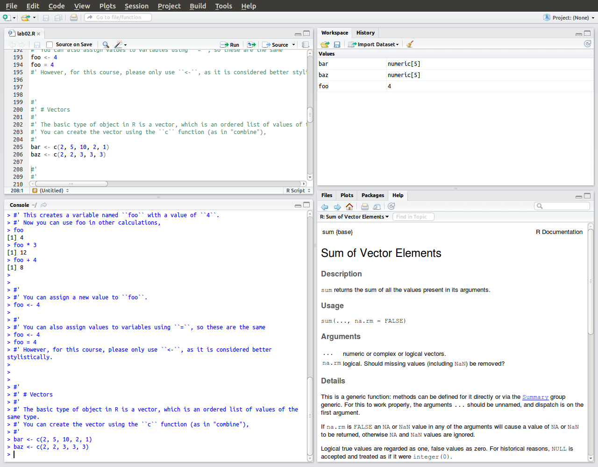

```{r echo=FALSE,results='hide'}
knitr::opts_chunk$set(results = 'hide', warning = FALSE, message = FALSE)
```

# Learning Objectives

1. Install R and Rstudio
2. 
3. Find help

# Installing R

Install R, Rstudio and **devtools**. Follow the instructions [here](http://pols503.github.io/pols_503_sp15/getting_help_with_r.html).

# Orientation with RStudio

R is the name of the programming language, and RStudio is a convenient and widely used interface to that language.

Since you will be using it for the remainder of the course, you should familiarize yourself with the RStudio GUI.



It consists of four windows,

1. Bottom left: The **console** window. You type commands at the ``>`` prompt and R executes them.
2. Top left: The **editor** window. Here you can edit and save R scripts which contain multiple R commands.
    - You can open a new R script using *File -> New -> R script*.
    - If you highlight an area, you can run those commands in the console with the "Run" button.
    - You can run all the commands in the **editor** window using the "Source" button.
3. Top right
    - **workspace** lists all R objects (variables) that are defined
    - **history** lists all the commands that have been typed into the console.
4. Bottom right

    - **files** allows you to browse directories and open files.
    - **plots** displays any plots created. In this window you can toggle back through previously created plots.
    - **packages** shows which packages are installed and loaded.
    - **help** displays R help.

RStudio documentation can be found at <http://www.rstudio.com/ide/docs/>.
Of those, the most likely to be useful to you are:

- [Working in the Console](http://www.rstudio.com/ide/docs/using/console)
- [Editing and Executing Code](http://www.rstudio.com/ide/docs/using/source)
- [Viewing Command History](http://www.rstudio.com/ide/docs/using/history)


Go to *Tools > Global Options*. Change the font and color of the editor and console. Which one do you like the best? 

# Using R as a calculator

Although it is so much more, you can use R as a calculator.
For example, to add, subtract, multiply or divide:
```{r }
2 + 3
2 - 3
2 * 3
2 / 3
```

The power of a number is calculated with ``^``, e.g. $4^2$ is,

```{r }
4 ^ 2
```

R includes many functions for standard math functions.
For example, the square root function is ``sqrt``, e.g. $\sqrt{2}$,

```{r }
sqrt(2)
```

And you can combine many of them together
```{r}
(2 * 4 + 3 ) / 10
sqrt(2 * 2)
```

# Variables and Assignment

In R, you can save the results of calculations into objects that you can use later.
This is done using the special symbol, ``<-``.
For example, this saves the results of 2 + 2 to an object named ``foo`` [^1]
```{r}
foo <- 2 + 2
```
You can see that ``foo`` is equal to ``4``
```{r}
foo
```
And you can reuse foo in other calculations,
```{r}
foo + 3
foo / 2 * 8 + foo
```

[^1]: If you are curious as to why the variable was named `foo`, read [this](http://en.wikipedia.org/wiki/Foobar).

You can use `=` instead of `<-` for assignment.
You may see this in some other code.
There are some technical reasons to use `<-` instead of `=`, but the primary reason we will use `<-` instead of `=` is that this is the convention used in modern `R` programs.

Create a variable named whatever strikes your fancy and set it equal to the square root of 2.
Then multiply it by 4.


# Data and Data Frames

*Data frames* in R correspond to what you usually think of as a dataset or a spreadsheet, rows are observations and columns are variables.

Use the `gapminder` data.


# R Scripts

You can save R commands in a file called an R script. 
To create a new R Script use *File -> New File -> R Script*.
This will create a new tab in the upper left panel which will have a name like "Untitled1".
Save this to a file with the extension ".R" (RStudio will warn you if you do not)

To see how this works, write a few commands in the editor.
For example,
```{r}
2 + 2
3 + 8
mean(c(1, 2, 3))
```
You can run the current line or highlighted section with *Ctl-Enter* or the *Run* button. 
You can run the *entire* script with *Ctl-Shift-S* or the *Source* button.


# Comments

Any R code following a hash (``#``) is not executed.
These are called comments, and can and **should** be used to annotate and explain your code.
For example, this doesn't do anything.
```{r}
#thisisacomment
```
And in this, nothing after the ``#`` is executed,
```{r}
#this is still a comment
2 + 2 # this is also a comment
```


What is this equal to?
```{r}
5 * 4 # + 3 # - 8
```


# Getting Started

1. Create a new project.

    1. *File -> New Project*
    2. Select "New Directory"
    3. Select "Empty Project"
    4. Select a name for your project as Directory Name.
	   "POLS_503_Labs" is as good as any, and better than most.
       Then choose where to put this directory with "Create project as subdirectory of".
       Don't worry about the other options.

2. Creating your first R Markdown Document

    1. *File -> New File -> R Markdown*
    2. Choose a title and author for your file.  HTML output is fine. 
    3. Hit OK. This will open a template for your Markdown file. **Save this file now.**
    4. Cheatsheet and additional resources available at http://rmarkdown.rstudio.com/

# Read In Data

In this example we will use data on gapminder

Download the 

```{r}
gapminder <- read.csv("gapminder.csv", stringsAsFactors=FALSE)
```

# Look at the Data
```{r}
gapminder
```

This is a lot of information. How can we get a more useful picture of the dataset as a whole?

```{r}
dim(gapminder) #This will show the dimensions of the dataframe. Row first, column second. 
names(gapminder)
head(gapminder)
summary(gapminder)

```

1. What are the variables in the dataset?
2. How many observations are there?
3. What types of data are the different variables?

## More on dataframes and variables
You can extract single variables (or columns) and perform different operations on them.
To extract a variable, we use the $:
```{r }
gapminder$lifeExp
```

Again, perhaps a summary may be more interesting. We can do more specific operations on this variable alone:

```{r}
mean(gapminder$lifeExp)
median(gapminder$lifeExp)
sd(gapminder$lifeExp)
min(gapminder$lifeExp)
max(gapminder$lifeExp)
```

Let's look at the distribution of the variable `lifeExp`. 

You will use the **ggplot2** package for graphics.
In order to use it, you will need to load it using `library()`
```{r}
library("ggplot2")
```


```{r}
ggplot(gapminder, aes(x = lifeExp)) +
  geom_histogram()
```
We could also save the plot to a variable 
```{r}
lifexp_plot <- ggplot(gapminder, aes(x = lifeExp)) +
                      geom_histogram()
```
If you just write the variable it will print the object, which in this case creates the plot
```{r}
lifexp_plot
```

## Now explore another variable of your choosing

1. Look at some summary statistics for that variable.
2. Visualize the distribution of that variable with a histogram.
3. Describe this distribution in plain ordinary English to your partner.
4. Write it as discussion in your R Markdown file.

# Exploring relationships between variables

Facet the data by continent:
```{r}
lifexp_plot + facet_wrap( ~ continent)
```

1. Describe how the distribution varies across the continents (Write it in your Markdown!)

## Scatter GDP/LifeExp
## Add best fit & CIs

1. Write about the relationship.  

```{r}
ggplot(gapminder, aes(y = lifeExp, x = log(gdpPercap))) + geom_point() + geom_smooth() + facet_wrap( ~ year)

library("dplyr")
gapminder1977 <- filter(gapminder, year == 1977)

ggplot(gapminder1977, )
```

## Getting Help with R

Refer to [Getting Help with R](getting

1. Refer to http://docs.ggplot2.org/current/ to find out how to create a density plot. Create a density plot of `gdpPercap`. Is is right skewed, left skewed, or symmetric? 
2. Go to stackoverlow and search for questions with tag `[r]`. 
    * What are featured questions today? 
    * What is the most voted question?
	* What is in the info tab?
3. Find and download the cowsay package. You cannot use `install.packages`. What does the `cowsay` function do? Run it with something fun (it'll make make sense once you know what it does).

